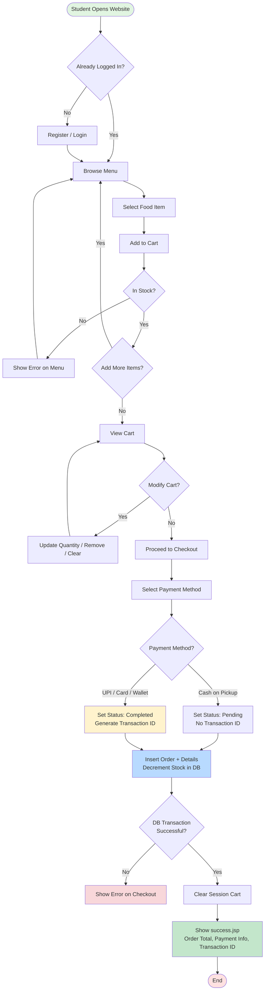
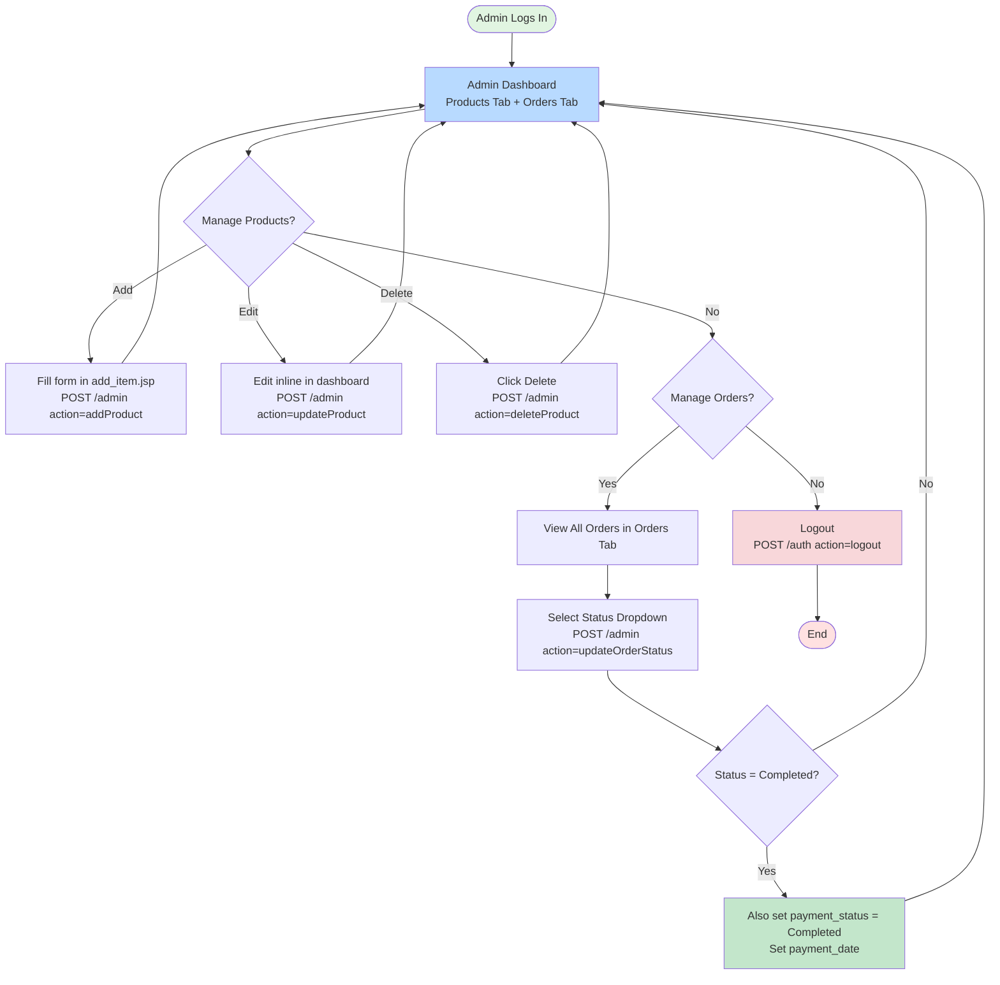
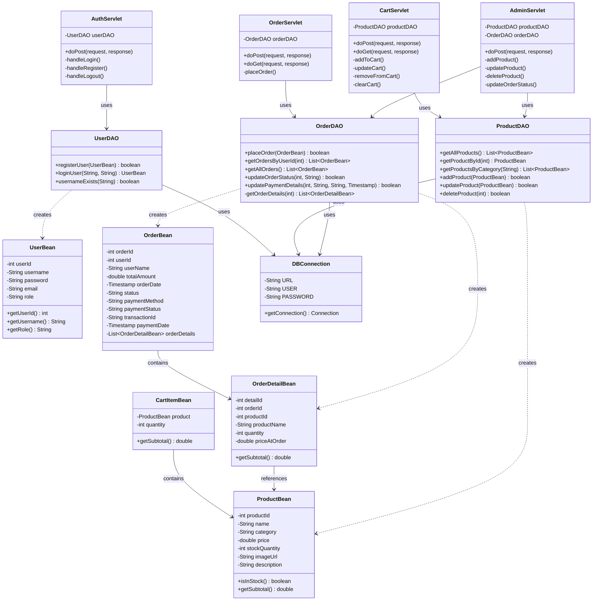
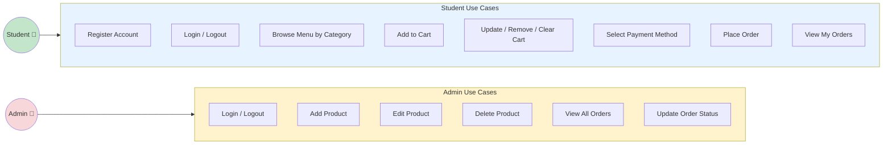
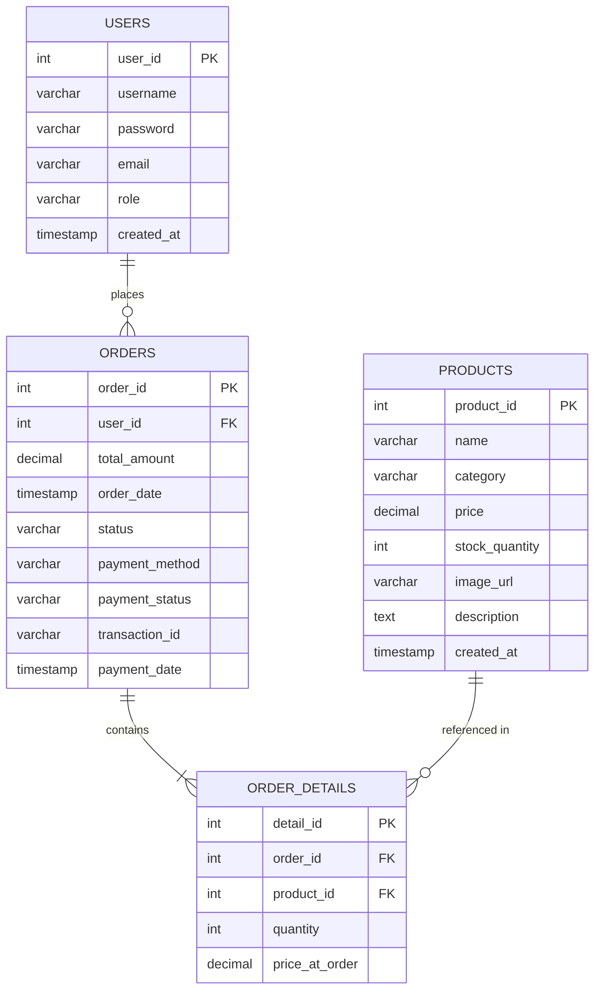
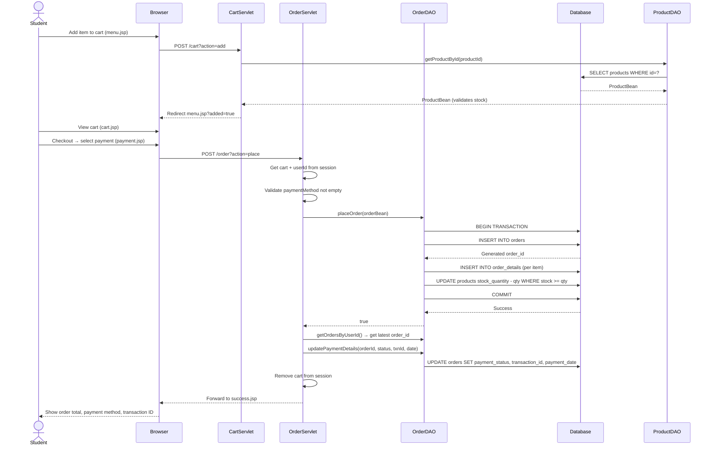
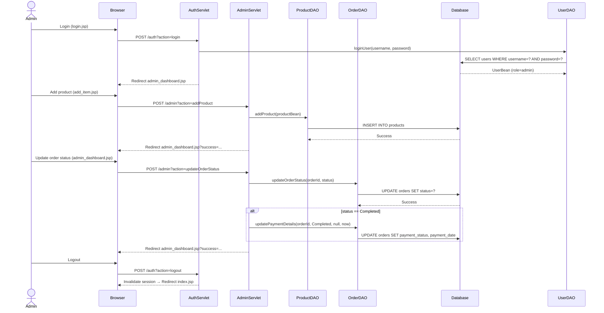

# 🍽️ Online College Canteen Ordering System

[](https://www.oracle.com/java/)
[](https://jakarta.ee/)
[](https://www.mysql.com/)
[](LICENSE)

A web-based application for managing college canteen operations, enabling students to order food online and administrators to manage products and orders.

---

## 📑 Table of Contents

- [Introduction](#-introduction)
- [Tools & Technology Used](#-tools--technology-used)
- [Data Dictionary](#-data-dictionary)
- [UML Diagrams](#-uml-diagrams)
- [Code Structure](#-code-structure)
- [Installation & Setup](#-installation--setup)
- [User Manual](#-user-manual)
- [Conclusion & Future Work](#-conclusion--future-work)
- [References](#-references)
- [Contributors](#-contributors)

---

## 📖 Introduction

### Project Overview

The **Online College Canteen Ordering System** is a full-stack web application built with Jakarta EE that digitizes the manual canteen ordering process. Students can browse the menu, manage a shopping cart, place orders with payment method selection, and view their order history. Admins can manage food items and update order statuses through a dedicated dashboard.

### Problem Statement

The existing manual canteen system faces several critical challenges:

- ⏰ **Long queues during peak hours** causing significant time wastage for students
- ❌ **Inefficient order handling** leading to errors and customer dissatisfaction
- 💵 **Cash management issues** including incorrect change and financial discrepancies
- 📦 **Difficulty in inventory tracking** resulting in stockouts and wastage
- 📊 **No centralized system** for order history
- 💳 **Limited payment options** restricted to cash only

### Solution

**For Students:**
- Browse menu grouped by category with real-time stock availability
- Add items to session-based cart with quantity selection
- Select from multiple payment methods (Cash on Pickup, UPI, Card, College Wallet)
- View order history with payment and transaction details

**For Administrators:**
- Add, edit, and delete food products
- View all student orders and update order status
- When order marked Completed, payment status is automatically updated

### Key Features

✅ **User Authentication** — Register, login, logout with role detection  
✅ **Role-Based Access** — Students redirect to menu; admins redirect to dashboard  
✅ **Session-Based Cart** — Add, update quantity, remove item, clear cart  
✅ **Mock Payment** — Cash on Pickup (Pending) or UPI/Card/Wallet (auto-Completed with transaction ID)  
✅ **Order Placement** — JDBC transaction: inserts order + details, decrements stock atomically  
✅ **Order History** — Students view their own orders with all payment detail  
✅ **Admin Dashboard** — Two-tab UI: Products Management + Orders Management  
✅ **Product CRUD** — Add, update, delete products via AdminServlet  
✅ **Order Status Update** — Admin updates status; Completed also sets payment as Completed  

### Technology Stack

**Frontend:** JSP, HTML5, CSS3, JavaScript  
**Backend:** Jakarta EE 10 Servlets, JavaBeans, DAO Pattern  
**Database:** MySQL (`canteen_db`)  
**Server:** Apache Tomcat 10  
**Architecture:** MVC (Model-View-Controller)  
**Build:** Apache Ant (NetBeans project)  
**Version Control:** Git/GitHub

---

## 🛠️ Tools & Technology Used

### Frontend Technologies

| Technology | Version | Purpose |
|------------|---------|---------|
| **JSP (JavaServer Pages)** | 3.1 | Dynamic content generation |
| **HTML5** | — | Page structure |
| **CSS3** | — | Styling (`web/css/style.css`) |
| **JavaScript** | ES6+ | Tab switching, client-side interactions |

### Backend Technologies

| Technology | Version | Purpose |
|------------|---------|---------|
| **Java** | JDK 25 | Core language |
| **Jakarta EE** | 10 | Servlet API |
| **JDBC** | 4.3 | Database connectivity |
| **Apache Tomcat** | 10+ | Application server |

**Patterns used:**
- MVC — Servlets as controllers, JSPs as views, Beans as models
- DAO — Separate data access layer per entity

### Database

| Technology | Version | Purpose |
|------------|---------|---------|
| **MySQL** | 8.0 | Relational database (`canteen_db`) |
| **MySQL Connector/J** | 9.6.0 | JDBC driver |

### Development Tools

| Tool | Purpose |
|------|---------|
| **Apache NetBeans IDE 21** | IDE + Ant build |
| **MySQL Workbench 8.0** | Database management |
| **Git / GitHub** | Version control |

### System Requirements

**Software:**
- JDK 17 or higher
- MySQL Server 8.0 or higher
- Apache Tomcat 10+
- Web Browser (Chrome, Firefox, Edge, or Safari)

---

## 📊 Data Dictionary

### Database: `canteen_db`

Four normalized tables.

---

### Table 1: `users`

| Column | Data Type | Constraints | Description |
|--------|-----------|-------------|-------------|
| `user_id` | INT | PK, AUTO_INCREMENT | Unique user ID |
| `username` | VARCHAR(50) | UNIQUE, NOT NULL | Login username |
| `password` | VARCHAR(255) | NOT NULL | Password (plain text for demo) |
| `email` | VARCHAR(100) | — | Email address |
| `role` | VARCHAR(20) | DEFAULT 'student' | `student` or `admin` |
| `created_at` | TIMESTAMP | DEFAULT CURRENT_TIMESTAMP | Account creation time |

**Relationships:** One user → many orders (1:N with `orders`)

---

### Table 2: `products`

| Column | Data Type | Constraints | Description |
|--------|-----------|-------------|-------------|
| `product_id` | INT | PK, AUTO_INCREMENT | Unique product ID |
| `name` | VARCHAR(100) | NOT NULL | Product name |
| `category` | VARCHAR(50) | NOT NULL | Category (e.g., Breakfast, Lunch, Snacks, Beverages) |
| `price` | DECIMAL(10,2) | NOT NULL | Price in rupees |
| `stock_quantity` | INT | DEFAULT 0 | Current stock |
| `image_url` | VARCHAR(255) | — | Optional image URL |
| `description` | TEXT | — | Optional description |
| `created_at` | TIMESTAMP | DEFAULT CURRENT_TIMESTAMP | Creation time |

**Relationships:** One product → many `order_details` (1:N)

---

### Table 3: `orders`

| Column | Data Type | Constraints | Description |
|--------|-----------|-------------|-------------|
| `order_id` | INT | PK, AUTO_INCREMENT | Unique order ID |
| `user_id` | INT | FK → `users.user_id`, NOT NULL | Ordering student |
| `total_amount` | DECIMAL(10,2) | NOT NULL | Order total |
| `order_date` | TIMESTAMP | DEFAULT CURRENT_TIMESTAMP | When placed |
| `status` | VARCHAR(20) | DEFAULT 'Pending' | Pending / Preparing / Ready / Completed / Cancelled |
| `payment_method` | VARCHAR(50) | DEFAULT 'Cash on Pickup' | Cash on Pickup / UPI / Credit Card / College Wallet |
| `payment_status` | VARCHAR(20) | DEFAULT 'Pending' | Pending / Completed |
| `transaction_id` | VARCHAR(100) | — | Auto-generated for online payments (`TXN{orderId}{timestamp}`) |
| `payment_date` | TIMESTAMP | NULL | Set when payment is Completed |

**Relationships:** Belongs to one user; has many `order_details`

---

### Table 4: `order_details`

| Column | Data Type | Constraints | Description |
|--------|-----------|-------------|-------------|
| `detail_id` | INT | PK, AUTO_INCREMENT | Unique detail ID |
| `order_id` | INT | FK → `orders.order_id` | Parent order |
| `product_id` | INT | FK → `products.product_id` | Ordered product |
| `quantity` | INT | NOT NULL | Quantity ordered |
| `price_at_order` | DECIMAL(10,2) | NOT NULL | Price snapshot at time of order |

---

### Complete Database Schema

```sql
CREATE DATABASE canteen_db;
USE canteen_db;

CREATE TABLE users (
    user_id INT PRIMARY KEY AUTO_INCREMENT,
    username VARCHAR(50) UNIQUE NOT NULL,
    password VARCHAR(255) NOT NULL,
    email VARCHAR(100),
    role VARCHAR(20) DEFAULT 'student',
    created_at TIMESTAMP DEFAULT CURRENT_TIMESTAMP
);

CREATE TABLE products (
    product_id INT PRIMARY KEY AUTO_INCREMENT,
    name VARCHAR(100) NOT NULL,
    category VARCHAR(50) NOT NULL,
    price DECIMAL(10,2) NOT NULL,
    stock_quantity INT DEFAULT 0,
    image_url VARCHAR(255),
    description TEXT,
    created_at TIMESTAMP DEFAULT CURRENT_TIMESTAMP
);

CREATE TABLE orders (
    order_id INT PRIMARY KEY AUTO_INCREMENT,
    user_id INT NOT NULL,
    total_amount DECIMAL(10,2) NOT NULL,
    order_date TIMESTAMP DEFAULT CURRENT_TIMESTAMP,
    status VARCHAR(20) DEFAULT 'Pending',
    payment_method VARCHAR(50) DEFAULT 'Cash on Pickup',
    payment_status VARCHAR(20) DEFAULT 'Pending',
    transaction_id VARCHAR(100),
    payment_date TIMESTAMP NULL,
    FOREIGN KEY (user_id) REFERENCES users(user_id) ON DELETE CASCADE
);

CREATE TABLE order_details (
    detail_id INT PRIMARY KEY AUTO_INCREMENT,
    order_id INT NOT NULL,
    product_id INT NOT NULL,
    quantity INT NOT NULL,
    price_at_order DECIMAL(10,2) NOT NULL,
    FOREIGN KEY (order_id) REFERENCES orders(order_id) ON DELETE CASCADE,
    FOREIGN KEY (product_id) REFERENCES products(product_id) ON DELETE CASCADE
);
```

---

## 📐 UML Diagrams

### 1. Flow Chart — Student Order Process



---

### 2. Flow Chart — Admin Operations



---

### 3. Class Diagram — MVC Architecture



---

### 4. Use Case Diagram



---

### 5. E-R Diagram



---

### 6. Sequence Diagram — Student Place Order



---

### 7. Sequence Diagram — Admin Manage Products & Orders



---

## 💻 Code Structure

### Project Structure

```
Online-College-Canteen-Ordering-System/
├── src/
│   └── java/
│       └── com/
│           └── canteen/
│               ├── model/
│               │   ├── UserBean.java
│               │   ├── ProductBean.java
│               │   ├── CartItemBean.java
│               │   ├── OrderBean.java
│               │   └── OrderDetailBean.java
│               ├── dao/
│               │   ├── UserDAO.java
│               │   ├── ProductDAO.java
│               │   └── OrderDAO.java
│               ├── controller/
│               │   ├── AuthServlet.java
│               │   ├── CartServlet.java
│               │   ├── OrderServlet.java
│               │   └── AdminServlet.java
│               └── util/
│                   └── DBConnection.java
├── web/
│   ├── css/
│   │   └── style.css
│   ├── includes/
│   │   └── navbar.jsp
│   ├── index.jsp
│   ├── login.jsp
│   ├── register.jsp
│   ├── menu.jsp
│   ├── cart.jsp
│   ├── checkout.jsp
│   ├── payment.jsp
│   ├── success.jsp
│   ├── my_orders.jsp
│   ├── admin_dashboard.jsp
│   ├── add_item.jsp
│   ├── META-INF/
│   │   └── context.xml
│   └── WEB-INF/
│       └── web.xml
├── nbproject/               # NetBeans Ant build configuration
├── build.xml
├── .gitignore
├── LICENSE
└── README.md
```

### Servlet URL Mappings (web.xml)

| URL Pattern | Servlet | Actions |
|-------------|---------|---------|
| `/auth` | AuthServlet | `login`, `register`, `logout` |
| `/cart` | CartServlet | `add`, `update`, `remove`, `clear` |
| `/order` | OrderServlet | `place` (POST); GET → my_orders.jsp |
| `/admin` | AdminServlet | `addProduct`, `updateProduct`, `deleteProduct`, `updateOrderStatus` |

### Key Code Snippets

**OrderDAO.java** — Atomic order placement with stock concurrency check
```java
String stockSql = "UPDATE products SET stock_quantity = stock_quantity - ? " +
                  "WHERE product_id = ? AND stock_quantity >= ?";
int affectedRows = stockStmt.executeUpdate();
if (affectedRows == 0) {
    conn.rollback();
    return false;
}
```

**OrderServlet.java** — Transaction ID generation for online payments
```java
transactionId = "TXN" + orderId + System.currentTimeMillis();
paymentDate = new java.sql.Timestamp(System.currentTimeMillis());
```

**AdminServlet.java** — Auto-complete payment on order completion
```java
if (success && "Completed".equals(status)) {
    orderDAO.updatePaymentDetails(orderId, "Completed", null,
        new java.sql.Timestamp(System.currentTimeMillis()));
}
```

---

## 🚀 Installation & Setup

### Prerequisites

- JDK 17 or higher
- MySQL 8.0 or higher
- Apache Tomcat 10+
- Apache NetBeans IDE 21
- MySQL Connector/J 9.6.0

### Step 1: Clone the Repository

```bash
git clone https://github.com/purvakumar-dalwadi/Online-College-Canteen-Ordering-System.git
cd Online-College-Canteen-Ordering-System
```

### Step 2: Database Setup

```bash
mysql -u root -p
```

```sql
CREATE DATABASE canteen_db;
USE canteen_db;
-- Run the CREATE TABLE statements from the Data Dictionary above
```

Insert sample data:
```sql
INSERT INTO users (username, password, email, role) VALUES
('admin', 'admin123', 'admin@college.com', 'admin'),
('student', 'student123', 'student@college.com', 'student');

INSERT INTO products (name, category, price, stock_quantity, description) VALUES
('Masala Dosa', 'Breakfast', 40.00, 50, 'Crispy dosa with potato masala'),
('Paneer Butter Masala', 'Lunch', 80.00, 30, 'Rich paneer curry'),
('Samosa', 'Snacks', 15.00, 80, 'Crispy potato samosa'),
('Chai', 'Beverages', 10.00, 200, 'Hot masala tea');
```

### Step 3: Configure Database Connection

Edit `src/java/com/canteen/util/DBConnection.java`:
```java
private static final String URL = "jdbc:mysql://localhost:3306/canteen_db";
private static final String USER = "root";
private static final String PASSWORD = "your_password";
```

> **Important:** Never commit database credentials to GitHub.

### Step 4: Add MySQL Connector

In NetBeans:
- Right-click **Libraries** → **Add JAR/Folder**
- Select `mysql-connector-j-9.6.0.jar`

Or place it in: `web/WEB-INF/lib/mysql-connector-j-9.6.0.jar`

### Step 5: Build and Deploy

In NetBeans:
- Right-click project → **Clean and Build**
- Right-click project → **Run** (deploys to configured Tomcat)

Access at:
```
http://localhost:8080/OnlineCollegeCanteenOrderingSystem/
```

### Step 6: Default Login Credentials

| Role | Username | Password |
|------|----------|----------|
| Student | `student` | `student123` |
| Admin | `admin` | `admin123` |

### Troubleshooting

| Issue | Solution |
|-------|----------|
| Database connection failed | Check MySQL is running; verify credentials in `DBConnection.java` |
| ClassNotFoundException for MySQL driver | Add `mysql-connector-j-9.6.0.jar` to `WEB-INF/lib/` |
| 404 Error | Verify Tomcat is running and context path is correct |
| Build errors | Check JDK 17+ and Jakarta EE 10 dependencies |

---

## 📱 User Manual

### For Students

#### 1. Register / Login
1. Open the app and go to **Login** or **Register**
2. Register fills username, email, password (role auto-set to `student`)
3. Login redirects to **menu.jsp**

#### 2. Browse Menu
- Products are grouped by category
- Each card shows name, description, price, and stock count
- Out-of-stock items show "Out of Stock" with no add button

#### 3. Shopping Cart
- Add items from menu with quantity selector
- Cart page: update quantity, remove item, or clear all
- Proceed to checkout from cart

#### 4. Payment
- Review order total on checkout.jsp
- Select payment method on payment.jsp:
  - **Cash on Pickup** → payment stays Pending until admin marks Completed
  - **UPI / Credit Card / College Wallet** → payment auto-marked Completed with a transaction ID

#### 5. Order Confirmation (success.jsp)
- Shows order total, payment method, payment status, and transaction ID (if applicable)

#### 6. Order History (my_orders.jsp)
- View all past orders with status, payment info, transaction ID, and itemised details

---

### For Administrators

#### 1. Login
- Use admin credentials; redirected to **admin_dashboard.jsp**

#### 2. Products Tab
- View all products in a table
- **Add New Item** → goes to add_item.jsp (name, category, price, stock, description)
- **Edit** → edits product inline and submits via `action=updateProduct`
- **Delete** → removes product via `action=deleteProduct`

#### 3. Orders Tab
- View all student orders with username, total, payment info
- Select new status from dropdown → submit via `action=updateOrderStatus`
- If status set to **Completed**, payment_status is also automatically set to Completed

---

## 🎯 Conclusion & Future Work

### Key Achievements

✅ Fully functional Jakarta EE MVC web application  
✅ Session-based cart with stock validation  
✅ JDBC transaction for atomic order placement  
✅ Mock payment with transaction ID generation  
✅ Admin product CRUD and order status management  
✅ Role-based access control  

### Future Enhancements

1. **Password hashing** — BCrypt for secure password storage (currently plain text)
2. **Real payment gateway** — Razorpay or Stripe integration
3. **Email notifications** — Order confirmation and ready-for-pickup alerts
4. **Advanced search/filter** — Filter menu by category or price range
5. **QR code pickup** — QR on success page for contactless verification

---

## 📚 References

1. Jakarta Servlet Specification 6.0 — https://jakarta.ee/specifications/servlet/6.0/
2. JSP 3.1 Specification — https://jakarta.ee/specifications/pages/3.1/
3. MySQL 8.0 Reference Manual — https://dev.mysql.com/doc/refman/8.0/en/
4. Apache Tomcat 10.1 Documentation — https://tomcat.apache.org/tomcat-10.1-doc/
5. JDBC 4.3 API — https://docs.oracle.com/javase/8/docs/technotes/guides/jdbc/
6. OWASP Top 10 — https://owasp.org/www-project-top-ten/
7. Pro Git Book — https://git-scm.com/book/en/v2

---

## 👥 Contributors

**Purvakumar Dalwadi**  
Role: Full Stack Developer  
GitHub: [@purvakumar-dalwadi](https://github.com/purvakumar-dalwadi)

### Acknowledgments

- Department of Information Technology — for resources and guidance
- Course Instructor — for project mentorship

---

## 📄 License

MIT License — see [LICENSE](LICENSE) for details.

---

<div align="center">

Made with ❤️ by Purvakumar Dalwadi  
**Dharmsinh Desai University, Nadiad**  
**Department of Information Technology**  
**March 2026**

</div>